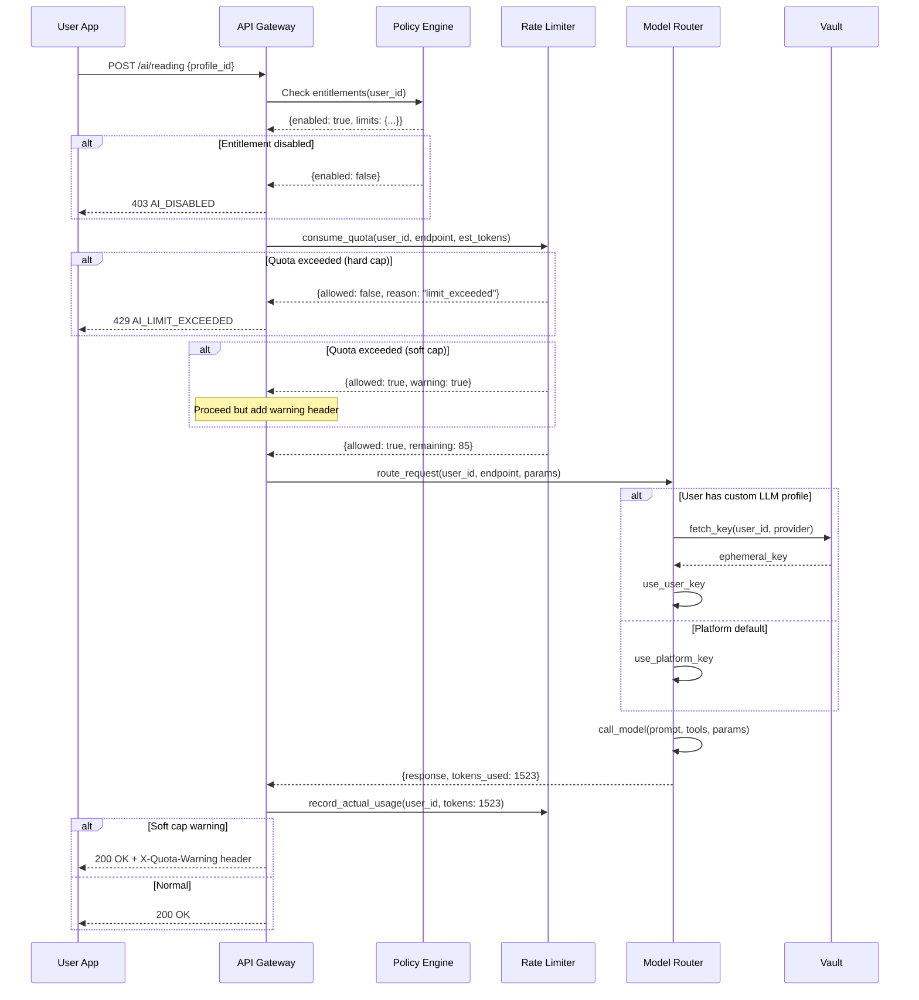
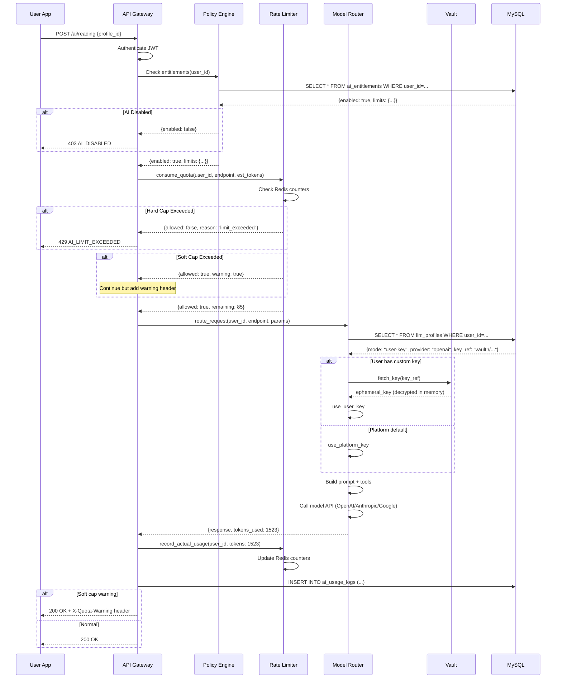

# ChandraHoro V2.1 — AI Features PRD
## Product Requirements Document

**Version:** 2.1  
**Owner:** Product & AI Engineering  
**Date:** October 25, 2025  
**Timezone:** Asia/Kolkata  
**Status:** Planning → Development  

---

## Executive Summary

ChandraHoro V2.1 adds production-grade AI capabilities to the existing V1 MVP, transforming it from a calculation engine into an intelligent astrology companion. This release introduces a complete Admin Control Plane with AI entitlements, per-user quotas, rate limiting, and optional user-level LLM configuration, while maintaining V1's core chart calculation excellence.

**What's New:**
- **Admin Control Plane**: Full RBAC system with Owner, Admin, Support, and Analyst roles
- **AI Entitlements System**: Per-user AI quotas (requests/day, tokens/day), model restrictions, time-bound access
- **User-Level LLM Config**: Users can bring their own API keys (OpenAI, Anthropic, Google)
- **Daily/Weekly AI Readings**: Automated personalized insights delivered via feed + notifications
- **AI Astro-Guide Chat**: Conversational assistant grounded in real chart calculations
- **Policy & Rate Limiting**: Soft/hard caps, metering, audit logs, fallback strategies
- **Enhanced Security**: Write-only key vault, PII encryption, comprehensive audit trails

**Why It Matters:**
V2 enables monetization through tiered AI access while maintaining safety, compliance, and cost control. The admin plane provides enterprise-grade controls for managing thousands of users with varying AI entitlements.

---

## Table of Contents

1. [Assumptions & Dependencies](#1-assumptions--dependencies)
2. [Product Goals & Non-Goals](#2-product-goals--non-goals)
3. [Personas & Jobs-to-be-Done](#3-personas--jobs-to-be-done)
4. [V2 Feature Set Overview](#4-v2-feature-set-overview)
5. [Admin Control Plane](#5-admin-control-plane)
6. [AI Entitlements Model](#6-ai-entitlements-model)
7. [User-Level LLM Configuration](#7-user-level-llm-configuration)
8. [AI/LLM Architecture](#8-aillm-architecture)
9. [Policy, Rate-Limiting & Metering](#9-policy-rate-limiting--metering)
10. [Data Model](#10-data-model)
11. [Public & Admin APIs](#11-public--admin-apis)
12. [Security, Privacy & Compliance](#12-security-privacy--compliance)
13. [Observability & Analytics](#13-observability--analytics)
14. [Non-Functional Requirements](#14-non-functional-requirements)
15. [Rollout Plan](#15-rollout-plan)
16. [Risks & Mitigations](#16-risks--mitigations)
17. [Acceptance Criteria](#17-acceptance-criteria)
18. [Test Plan](#18-test-plan)
19. [Appendix: JSON Schemas](#19-appendix-json-schemas)
20. [Appendix: Diagrams](#20-appendix-diagrams)

---

## 1. Assumptions & Dependencies

### Assumptions
1. **V1 is production-ready** with stable APIs for chart calculation, export, and basic AI interpretation
2. **MySQL 8.0+** is the primary database; Redis available for caching/sessions
3. **Existing users** can be migrated to V2 with default AI entitlements
4. **LLM providers** (Anthropic, OpenAI, Google) have stable APIs
5. **English + Telugu** are launch languages; RTL support for future expansion
6. **Timezone** defaults to Asia/Kolkata for Indian users
7. **Consent flows** are already implemented in V1 for DPDP/GDPR compliance

### Dependencies
- **External**: Anthropic Claude API, OpenAI GPT-4 API, Google Gemini API
- **Infrastructure**: Redis for rate limiting, Celery for async jobs, Nginx for load balancing
- **Internal**: V1 chart engine, location services, export services must remain stable
- **Compliance**: Legal review of AI disclaimers, data retention policies

---

## 2. Product Goals & Non-Goals

### Goals (V2)
✅ **Enable AI-powered daily/weekly readings** with personalized insights based on transits  
✅ **Launch Admin Control Plane** with full RBAC and AI entitlement management  
✅ **Implement per-user AI quotas** to control costs and enable tiered pricing  
✅ **Support user-provided LLM keys** for power users and enterprise customers  
✅ **Add conversational AI Astro-Guide** for natural language Q&A about charts  
✅ **Build policy enforcement layer** for rate limiting, metering, and fallbacks  
✅ **Maintain safety guardrails** (no medical/financial/legal advice)  
✅ **Support bilingual experience** (English + Telugu)  

### Non-Goals (V2)
❌ **No live astrologer consultations** (deferred to V3)  
❌ **No advanced corporate/HR features** (Jyotish Drishti modules are separate product)  
❌ **No ShareMarks stock research** (out of scope for core astrology app)  
❌ **No mobile native apps** (web-first; wrappers later)  
❌ **No social features** (comments, forums, groups)  
❌ **No payment integration yet** (entitlements set manually by admins; billing in V2.1)  

---

## 3. Personas & Jobs-to-be-Done

### User Personas

| Persona | Age | Key JTBD | AI Usage Pattern |
|---------|-----|----------|------------------|
| **Seeker** | 18-35 | "I want quick daily guidance I can trust" | Heavy daily reading consumer; occasional chat |
| **Planner** | 28-45 | "I need weekly roadmaps for decisions" | Weekly reading + compatibility checks |
| **Skeptic-Curious** | 20-40 | "Show me the logic behind predictions" | Deep chat user; wants transparent explanations |
| **Power User** | 30-50 | "I want control over AI models/params" | Brings own API key; tweaks temperature/models |

### Admin Personas

| Role | Responsibilities | Access Level |
|------|-----------------|--------------|
| **Owner** | Platform strategy, billing, user lifecycle | Full access to all admin functions |
| **Admin** | User management, entitlements, support escalations | Manage users, quotas, view audit logs |
| **Support** | Help desk, quota resets, troubleshooting | View-only + limited quota resets |
| **Analyst** | Metrics, dashboards, A/B testing | Read-only metrics and anonymized data |

---

## 4. V2 Feature Set Overview

### 4.1 Daily & Weekly AI Readings
**Description**: Automated personalized readings generated each morning based on current transits overlaid on natal chart.

**User Flow**:
1. User wakes up → opens app
2. Sees "Today's Reading" card with 3-5 bullet highlights
3. Taps to expand full reading (Work, Love, Health, Finance)
4. Can save, share, or ask follow-up questions in chat

**Technical**:
- Celery job runs daily at 5:00 AM IST for all active users
- Uses fast model (GPT-4 Mini / Claude Haiku) for cost efficiency
- Caches readings; reuses if chart + date identical
- Sends push notification if enabled (smart timing based on user behavior)

**Acceptance Criteria**:
- ✅ Daily reading appears by 6:00 AM IST for 99% of users
- ✅ Reading includes 3-5 highlights + expandable segments
- ✅ Respects user's tone preference (Mystic / Practical / Playful)
- ✅ Available in English + Telugu
- ✅ p95 latency < 1.5s (cached) / < 4s (fresh)

---

### 4.2 AI Astro-Guide Chat
**Description**: Conversational assistant that answers natural language questions about user's chart, transits, compatibility, etc.

**Example Interactions**:
- "When is a good time to start a business?"
- "Why is my 7th house important for marriage?"
- "How does Saturn in 10th house affect my career?"

**Technical**:
- Uses premium model (Claude Sonnet / GPT-4) for deep reasoning
- Tool-enabled: can call chart calculation, transit lookup, yoga detection
- RAG-backed: retrieves from curated astrology knowledge base
- Maintains conversation history (last 10 messages)
- Respects AI quotas (each message = 1 request)

**Acceptance Criteria**:
- ✅ Answers 10 canonical questions correctly ≥ 90% of time
- ✅ Cites sources (chart data, transits, yogas) in response
- ✅ Gracefully declines medical/financial/legal advice
- ✅ p95 latency < 4s per message
- ✅ Conversation history persists across sessions

---

### 4.3 Compatibility Analysis (Lite)
**Description**: Synastry analysis comparing two charts (user + partner/friend/family).

**User Flow**:
1. User enters partner's birth data
2. System computes synastry chart
3. AI generates plain-English summary:
   - 3 Strengths (e.g., "Emotional connection", "Shared goals")
   - 3 Watch-outs (e.g., "Communication friction", "Different life pace")
4. User can export as PDF or share image

**Technical**:
- Uses premium model for nuanced interpretation
- Compares planets, houses, aspects between two charts
- Consumes 2-3x tokens of daily reading (more complex)

**Acceptance Criteria**:
- ✅ Returns consistent summary with ≥3 strengths + ≥3 risks
- ✅ Available in English + Telugu
- ✅ Exportable as PDF/PNG
- ✅ p95 latency < 6s

---

### 4.4 Shareable Visuals
**Description**: Auto-styled zodiac/day cards for social media sharing.

**User Flow**:
1. User taps "Share" on daily reading
2. System generates image card with:
   - User's sun sign + moon sign
   - Top 3 highlights from reading
   - ChandraHoro branding + attribution
3. User shares to Instagram/WhatsApp/Twitter

**Technical**:
- Text → Image pipeline using PIL/Pillow
- Pre-designed templates with saffron/mandala theme
- Watermark + URL for organic growth
- Supports English + Telugu text

**Acceptance Criteria**:
- ✅ Generates image in < 2s p95
- ✅ Text is legible on mobile + desktop
- ✅ Respects brand guidelines
- ✅ Tracks share events for analytics

---

### 4.5 Push Notifications
**Description**: Opt-in smart notifications for daily readings and important transits.

**User Flow**:
1. User enables notifications during onboarding
2. System learns best time to send (based on open patterns)
3. Sends notification: "Your daily reading is ready ✨"
4. User taps → opens app to reading

**Technical**:
- Firebase Cloud Messaging (FCM) for push
- Celery job analyzes user's open times → finds optimal window
- Supports English + Telugu notification copy
- Respects quiet hours (10 PM - 6 AM)

**Acceptance Criteria**:
- ✅ Notifications sent within user's preferred window
- ✅ D7 retention increases by ≥5% vs. control group
- ✅ Unsubscribe rate < 5%
- ✅ Bilingual support

---

## 5. Admin Control Plane

### 5.1 Authentication & Sessions

**Admin Login Flow**:
```
1. Admin enters email
2. System sends OTP to email (6-digit, expires in 10 min)
3. Admin enters OTP
4. (Optional) Admin sets up TOTP (Google Authenticator) as backup
5. Session created (JWT token, expires in 24 hours)
```

**Endpoints**:
- `POST /admin/auth/login-otp` → Send OTP to email
- `POST /admin/auth/verify-otp` → Verify OTP, return JWT
- `POST /admin/auth/totp/setup` → Generate TOTP secret (QR code)
- `POST /admin/auth/totp/verify` → Verify TOTP code
- `POST /admin/auth/logout` → Invalidate session
- `GET /admin/auth/me` → Get current admin user info

**Security**:
- Email OTP: 6 digits, 10-min expiry, rate-limited (3 attempts/10 min)
- TOTP: 30-second window, backup codes (10) stored encrypted
- JWT: HS256, 24-hour expiry, includes role/permissions
- IP-based rate limiting: 10 login attempts/hour per IP
- MFA required for Owner/Admin roles

---

### 5.2 Role & Permission Matrix

| Role | Manage Users | Set Entitlements | View Audit Logs | Reset Quotas | View Metrics | Manage Content |
|------|--------------|------------------|-----------------|--------------|--------------|----------------|
| **Owner** | ✅ | ✅ | ✅ | ✅ | ✅ | ✅ |
| **Admin** | ✅ | ✅ | ✅ | ✅ | ✅ | ❌ |
| **Support** | ❌ | ❌ | ✅ (own actions) | ✅ (limited) | ❌ | ❌ |
| **Analyst** | ❌ | ❌ | ❌ | ❌ | ✅ | ❌ |

**Permission Enforcement**:
- Middleware checks JWT role against route permissions
- Returns `403 Forbidden` if role lacks permission
- All admin actions logged to audit trail

---

### 5.3 Admin Dashboard Features

#### User Management
- **List Users**: Search, filter (active/inactive, plan, location)
- **View User Details**: Profile, birth data, AI usage stats, entitlements
- **Edit User**: Update email, role, entitlements
- **Suspend/Activate**: Soft delete (retains data; blocks login)
- **Delete User**: Hard delete (GDPR/DPDP compliant; 30-day soft delete first)

#### AI Entitlements Management
- **View Entitlements**: See current limits, usage, remaining quota
- **Set Entitlements**: Configure requests/day, tokens/day, allowed models/endpoints
- **Set Expiry**: Time-bound access (e.g., trial expires after 14 days)
- **Soft vs Hard Caps**: Configure warning vs. blocking behavior
- **Bulk Operations**: Apply entitlements to user segments (e.g., "Free Plan → 10 req/day")

#### LLM Profile Management
- **View User's LLM Config**: See provider, model, params (keys are masked)
- **Rotate Keys**: Admin can trigger key rotation (user must re-enter key)
- **Revoke Keys**: Immediately invalidate user's API key

#### Audit Logs
- **View Logs**: Filter by actor, action, date range, target user
- **Export Logs**: CSV/JSON export for compliance
- **Immutable**: Logs cannot be edited; append-only

#### Metrics & Analytics
- **AI Usage Metrics**: Total requests, tokens, cost (by model, user, date)
- **User Engagement**: DAU/WAU, retention cohorts, feature usage
- **Error Rates**: 429s, 500s, refusal rates, moderation triggers
- **Model Performance**: Latency p50/p95/p99, cache hit rate

---

## 6. AI Entitlements Model

### 6.1 Entitlement Schema

```json
{
  "id": "uuid",
  "user_id": "uuid",
  "enabled": true,
  "limits": {
    "requests_per_day": 100,
    "tokens_per_day": 200000,
    "allowed_models": ["gpt-4-mini", "claude-haiku", "gemini-flash"],
    "allowed_endpoints": ["reading.daily", "chat", "compat.lite"]
  },
  "window_tz": "Asia/Kolkata",
  "starts_at": "2025-10-26T00:00:00+05:30",
  "ends_at": null,
  "cap_mode": "soft",
  "metadata": {
    "plan": "free",
    "notes": "Trial user - expires 2025-11-10"
  },
  "created_at": "datetime",
  "updated_at": "datetime"
}
```

### 6.2 Entitlement Plans (Default Presets)

| Plan | Requests/Day | Tokens/Day | Models | Endpoints | Cap Mode |
|------|--------------|------------|--------|-----------|----------|
| **Free** | 10 | 50,000 | mini/haiku/flash | daily, compat.lite | soft |
| **Basic** | 50 | 150,000 | mini/haiku/flash | daily, chat, compat.lite | soft |
| **Pro** | 200 | 500,000 | all | all | soft |
| **Enterprise** | unlimited | unlimited | all | all | none |

**Plan Defaults**:
- New users start on **Free** plan
- Admins can manually upgrade users
- V2.1 will add payment integration for self-service upgrades

---

### 6.3 Soft vs Hard Caps

#### Soft Cap (Warning)
- User exceeds limit → request still processed
- Response includes header: `X-Quota-Warning: "80% of daily limit used"`
- Next day → quota resets; no block

**Use Case**: Occasional overage; user experience > cost control

#### Hard Cap (Block)
- User exceeds limit → request rejected
- Response: `429 Too Many Requests`
- Error body:
```json
{
  "error": "AI_LIMIT_EXCEEDED",
  "message": "Daily AI request limit reached. Resets at 00:00 IST.",
  "limits": {
    "requests_per_day": 10,
    "used_today": 10,
    "resets_at": "2025-10-27T00:00:00+05:30"
  }
}
```

**Use Case**: Strict cost control; prevent abuse

---

### 6.4 Time-Bound Access

**Scenario**: Trial users get 14 days of Pro access

```json
{
  "starts_at": "2025-10-25T00:00:00+05:30",
  "ends_at": "2025-11-08T23:59:59+05:30"
}
```

**Behavior**:
- Before `starts_at`: Entitlements not active; fallback to default
- Within window: Entitlements active
- After `ends_at`: Entitlements expire; user reverts to Free plan
- System sends email reminder 3 days before expiry

---

### 6.5 Precedence Rules

**Order of Evaluation**:
1. **User-level entitlement** (if set) takes precedence
2. **Plan default** (if user-level not set)
3. **Global default** (fallback)

**Example**:
- User is on "Basic" plan (50 req/day)
- Admin sets user-level override: 200 req/day
- **Effective limit**: 200 req/day (user-level wins)

---

## 7. User-Level LLM Configuration

### 7.1 Use Case
Power users or enterprise customers want to:
- Use their own API keys (avoid sharing quota)
- Control model selection (e.g., force GPT-4 over GPT-4 Mini)
- Tweak generation params (temperature, max_tokens, top_p)
- Apply custom safety presets

### 7.2 LLM Profile Schema

```json
{
  "id": "uuid",
  "user_id": "uuid",
  "mode": "user-key",
  "provider": "openai",
  "model": "gpt-4",
  "params": {
    "temperature": 0.7,
    "max_tokens": 1000,
    "top_p": 1.0,
    "system_preset": "practical"
  },
  "safety": {
    "preset": "strict",
    "blocked_topics": ["medical", "financial", "legal"]
  },
  "key_ref": "vault://secret/user-123-openai-key",
  "key_last_4": "x7K9",
  "created_at": "datetime",
  "updated_at": "datetime"
}
```

### 7.3 Key Storage (Write-Only Vault)

**Flow**:
1. User enters API key in settings
2. Frontend sends key to backend via HTTPS
3. Backend validates key (test API call)
4. Backend encrypts key, stores in HashiCorp Vault (or AWS Secrets Manager)
5. Returns vault reference: `vault://secret/user-{user_id}-{provider}-key`
6. **Never returns raw key** in any API response

**Vault Properties**:
- **Write-only**: Keys can be written but never read via API
- **Scoped**: Each key scoped to user_id
- **Masked in UI**: Only last 4 chars shown (e.g., "x7K9")
- **Rotation**: User can update key; old key overwritten
- **Revocation**: Admin/user can delete key; falls back to platform default

**Security**:
- Keys encrypted at rest (AES-256)
- Keys decrypted only in LLM router (in-memory; not logged)
- Audit log records key creation/rotation/deletion (not key itself)

---

### 7.4 Model Policy Enforcement

**Allowed Models** (configurable per entitlement):
- `gpt-4-mini`, `gpt-4`, `gpt-4-turbo`
- `claude-haiku-3.5`, `claude-sonnet-3.5`
- `gemini-flash-2.0`, `gemini-pro-2.0`

**Validation**:
- User selects model in settings
- System checks `allowed_models` in entitlement
- If model not allowed → returns `403 MODEL_NOT_ALLOWED`

**Fallback**:
- If user's API key fails (invalid, quota exceeded) → fallback to platform key
- Log warning; notify user via email

---

## 8. AI/LLM Architecture

### 8.1 High-Level Pattern
**Tools-enabled LLM** + **RAG** + **Prompt Templates** + **Caching**

```
User Request
    ↓
Policy Engine (check entitlements)
    ↓
Rate Limiter (consume quota)
    ↓
LLM Router (select model based on task + user config)
    ↓
┌─────────────────────────────────────┐
│  LLM Call (with tools + RAG)        │
│  - Chart tools (ephemeris, houses)  │
│  - Profile tools (lookup user data) │
│  - Content RAG (astrology KB)       │
└─────────────────────────────────────┘
    ↓
Response + Token Usage
    ↓
Meter (record actual tokens used)
    ↓
Return to User
```

### 8.2 Tool Definitions

**Available Tools**:
1. **compute_natal_chart**(dob, tob, pob) → chart JSON
2. **compute_transits**(date, location) → planetary positions
3. **get_current_dasha**(user_id) → dasha period info
4. **lookup_yoga**(chart_id) → list of detected yogas
5. **search_astro_kb**(query) → relevant interpretations from RAG

**Example Tool Call**:
```json
{
  "tool": "compute_transits",
  "params": {
    "date": "2025-10-26",
    "location": {"lat": 17.385, "lon": 78.487}
  }
}
```

**Response**:
```json
{
  "sun": {"sign": "Libra", "degree": 8.5},
  "moon": {"sign": "Taurus", "degree": 12.3},
  "mars": {"sign": "Cancer", "degree": 22.1}
}
```

### 8.3 RAG (Retrieval-Augmented Generation)

**Knowledge Base**:
- 5000+ curated interpretations
- Organized by: Planet × Sign × House × Aspect × Transit
- Versioned (e.g., v1.0 interpretations; v1.1 refined copy)
- Editorially reviewed (no hallucinations)

**Vector Index**:
- OpenAI `text-embedding-3-small` (1536 dimensions)
- Stored in MySQL with JSON type (or Pinecone for vector-specific needs)
- Retrieves top 5 relevant chunks per query

**RAG Flow**:
```
1. User asks: "What does Saturn in 10th house mean?"
2. System embeds query → searches vector DB
3. Retrieves: "Saturn in 10th brings career discipline..."
4. LLM uses retrieved text as context for final answer
```

### 8.4 Prompt Templates

**System Prompt** (all AI calls):
```
You are an AI astrology assistant for ChandraHoro. 

Guidelines:
- Be supportive and insightful; avoid deterministic predictions
- No medical/financial/legal advice; redirect to professionals
- Use tools to ground answers in real chart data
- Cite sources (e.g., "Based on your Saturn in 10th house...")
- Respect user's tone preference: {tone_preset}
- Language: {language}

Safety:
- If user asks about health → "I can't provide medical advice. Please consult a doctor."
- If user asks about finances → "I can't give financial advice. Consider a financial advisor."
```

**User Prompt Templates**:
- **Daily Reading**: `Generate a daily reading for {user_name} on {date}. Use their natal chart {chart_id} and current transits.`
- **Chat**: `Answer the user's question: "{user_question}". Use tools as needed. Reference chart {chart_id}.`
- **Compatibility**: `Compare charts {chart_id_1} and {chart_id_2}. Provide 3 strengths and 3 watch-outs.`

### 8.5 Caching Strategy

**Cache Key**: `hash(chart_id + date + endpoint + model)`

**Cache Scenarios**:
1. **Daily Reading**: Same chart + same date → cache for 24 hours
2. **Transit Data**: Same date + location → cache for 1 hour
3. **Natal Chart**: Same birth data → cache indefinitely (until user edits profile)

**Cache Store**: Redis with TTL

**Cache Hit Rate Target**: > 70% for daily readings

---

## 9. Policy, Rate-Limiting & Metering

### 9.1 Enforcement Path



### 9.2 Rate Limiter Implementation

**Technology**: Redis with sliding window counters

**Counters**:
- `quota:{user_id}:date:{YYYY-MM-DD}:requests` → count of requests today
- `quota:{user_id}:date:{YYYY-MM-DD}:tokens` → count of tokens used today

**Algorithm**:
```python
def consume_quota(user_id, endpoint, estimated_tokens):
    date = today()
    entitlement = get_entitlement(user_id)
    
    requests_key = f"quota:{user_id}:date:{date}:requests"
    tokens_key = f"quota:{user_id}:date:{date}:tokens"
    
    current_requests = redis.get(requests_key) or 0
    current_tokens = redis.get(tokens_key) or 0
    
    # Check limits
    if current_requests >= entitlement.limits.requests_per_day:
        if entitlement.cap_mode == "hard":
            return {"allowed": False, "reason": "limit_exceeded"}
        else:
            return {"allowed": True, "warning": True}
    
    if current_tokens + estimated_tokens > entitlement.limits.tokens_per_day:
        if entitlement.cap_mode == "hard":
            return {"allowed": False, "reason": "token_limit_exceeded"}
        else:
            return {"allowed": True, "warning": True}
    
    # Consume quota
    redis.incr(requests_key)
    redis.incrby(tokens_key, estimated_tokens)
    redis.expire(requests_key, 86400)  # 24 hours
    redis.expire(tokens_key, 86400)
    
    return {"allowed": True, "remaining": entitlement.limits.requests_per_day - current_requests - 1}
```

### 9.3 Metering (Actual Usage Tracking)

**Purpose**: Track actual tokens used (vs estimated) for billing/analytics

**Flow**:
1. Before LLM call: Estimate tokens (e.g., 1000 for daily reading)
2. After LLM call: Record actual tokens from response (e.g., 1523)
3. Update counter: `redis.incrby(tokens_key, actual - estimated)`

**Daily Aggregation**:
- Celery job runs at midnight
- Sums up daily usage per user
- Writes to `ai_usage_logs` table for historical analytics
- Resets Redis counters

**Schema**:
```sql
CREATE TABLE ai_usage_logs (
    id VARCHAR(36) PRIMARY KEY,
    user_id VARCHAR(36) NOT NULL,
    date DATE NOT NULL,
    requests_count INT DEFAULT 0,
    tokens_count INT DEFAULT 0,
    cost_usd DECIMAL(10,4) DEFAULT 0,
    created_at TIMESTAMP DEFAULT CURRENT_TIMESTAMP,
    INDEX idx_user_date (user_id, date)
);
```

### 9.4 Fallback Rules

**Scenario 1: User's API Key Invalid**
- Error from provider: `401 Unauthorized`
- Action: Fallback to platform key; log warning
- Notification: Email user: "Your API key failed. Using platform default."

**Scenario 2: User's Model Not Allowed**
- User requests `gpt-4` but entitlement only allows `gpt-4-mini`
- Action: Return `403 MODEL_NOT_ALLOWED`
- Suggestion: "Upgrade to Pro plan to use GPT-4"

**Scenario 3: Platform Key Exhausted**
- All platform keys hit quota (unlikely with multiple keys)
- Action: Return `503 Service Unavailable`
- Fallback: Queue request for retry in 1 hour

---

## 10. Data Model

### 10.1 MySQL Schema (V2 Tables)

#### **users** (extended from V1)
```sql
CREATE TABLE users (
    id VARCHAR(36) PRIMARY KEY DEFAULT (UUID()),
    email VARCHAR(255) UNIQUE NOT NULL,
    password_hash VARCHAR(255) NOT NULL,
    full_name VARCHAR(255),
    phone VARCHAR(20),
    role ENUM('user', 'admin', 'owner', 'support', 'analyst') DEFAULT 'user',
    locale VARCHAR(10) DEFAULT 'en',  -- en, te
    timezone VARCHAR(50) DEFAULT 'Asia/Kolkata',
    tone_preference ENUM('mystic', 'practical', 'playful') DEFAULT 'practical',
    email_verified BOOLEAN DEFAULT FALSE,
    phone_verified BOOLEAN DEFAULT FALSE,
    is_active BOOLEAN DEFAULT TRUE,
    last_login_at TIMESTAMP NULL,
    created_at TIMESTAMP DEFAULT CURRENT_TIMESTAMP,
    updated_at TIMESTAMP DEFAULT CURRENT_TIMESTAMP ON UPDATE CURRENT_TIMESTAMP,
    INDEX idx_email (email),
    INDEX idx_role (role),
    INDEX idx_active (is_active)
);
```

#### **ai_entitlements**
```sql
CREATE TABLE ai_entitlements (
    id VARCHAR(36) PRIMARY KEY DEFAULT (UUID()),
    user_id VARCHAR(36) NOT NULL,
    enabled BOOLEAN DEFAULT TRUE,
    requests_per_day INT DEFAULT 10,
    tokens_per_day INT DEFAULT 50000,
    allowed_models JSON,  -- ["gpt-4-mini", "claude-haiku"]
    allowed_endpoints JSON,  -- ["reading.daily", "chat"]
    window_tz VARCHAR(50) DEFAULT 'Asia/Kolkata',
    starts_at TIMESTAMP NULL,
    ends_at TIMESTAMP NULL,
    cap_mode ENUM('soft', 'hard') DEFAULT 'soft',
    metadata JSON,  -- {"plan": "free", "notes": "..."}
    created_at TIMESTAMP DEFAULT CURRENT_TIMESTAMP,
    updated_at TIMESTAMP DEFAULT CURRENT_TIMESTAMP ON UPDATE CURRENT_TIMESTAMP,
    FOREIGN KEY (user_id) REFERENCES users(id) ON DELETE CASCADE,
    INDEX idx_user_id (user_id),
    INDEX idx_enabled (enabled),
    INDEX idx_expires (ends_at)
);
```

#### **llm_profiles**
```sql
CREATE TABLE llm_profiles (
    id VARCHAR(36) PRIMARY KEY DEFAULT (UUID()),
    user_id VARCHAR(36) NOT NULL,
    mode ENUM('platform', 'user-key') DEFAULT 'platform',
    provider ENUM('openai', 'anthropic', 'google', 'meta', 'mistral') NULL,
    model VARCHAR(100),  -- e.g., "gpt-4", "claude-sonnet-3.5"
    temperature DECIMAL(3,2) DEFAULT 0.70,
    max_tokens INT DEFAULT 1000,
    top_p DECIMAL(3,2) DEFAULT 1.00,
    system_preset ENUM('practical', 'mystic', 'playful') DEFAULT 'practical',
    safety_preset ENUM('strict', 'balanced', 'light') DEFAULT 'strict',
    blocked_topics JSON,  -- ["medical", "financial", "legal"]
    key_ref VARCHAR(255),  -- vault://secret/user-123-openai-key
    key_last_4 VARCHAR(4),  -- e.g., "x7K9"
    created_at TIMESTAMP DEFAULT CURRENT_TIMESTAMP,
    updated_at TIMESTAMP DEFAULT CURRENT_TIMESTAMP ON UPDATE CURRENT_TIMESTAMP,
    FOREIGN KEY (user_id) REFERENCES users(id) ON DELETE CASCADE,
    INDEX idx_user_id (user_id),
    INDEX idx_mode (mode)
);
```

#### **quota_counters** (Redis → MySQL daily backup)
```sql
CREATE TABLE quota_counters (
    id VARCHAR(36) PRIMARY KEY DEFAULT (UUID()),
    user_id VARCHAR(36) NOT NULL,
    date DATE NOT NULL,
    requests_count INT DEFAULT 0,
    tokens_count INT DEFAULT 0,
    last_reset_at TIMESTAMP DEFAULT CURRENT_TIMESTAMP,
    FOREIGN KEY (user_id) REFERENCES users(id) ON DELETE CASCADE,
    UNIQUE KEY unique_user_date (user_id, date),
    INDEX idx_user_date (user_id, date)
);
```

#### **ai_usage_logs**
```sql
CREATE TABLE ai_usage_logs (
    id VARCHAR(36) PRIMARY KEY DEFAULT (UUID()),
    user_id VARCHAR(36) NOT NULL,
    endpoint VARCHAR(100),  -- e.g., "reading.daily", "chat"
    model VARCHAR(100),  -- e.g., "gpt-4-mini"
    prompt_tokens INT,
    completion_tokens INT,
    total_tokens INT,
    cost_usd DECIMAL(10,6),
    latency_ms INT,
    status VARCHAR(20),  -- success, error, rate_limited
    error_code VARCHAR(50),
    created_at TIMESTAMP DEFAULT CURRENT_TIMESTAMP,
    FOREIGN KEY (user_id) REFERENCES users(id) ON DELETE CASCADE,
    INDEX idx_user_date (user_id, created_at),
    INDEX idx_endpoint (endpoint),
    INDEX idx_status (status)
);
```

#### **audit_logs**
```sql
CREATE TABLE audit_logs (
    id VARCHAR(36) PRIMARY KEY DEFAULT (UUID()),
    actor_id VARCHAR(36),
    actor_role ENUM('user', 'admin', 'owner', 'support', 'analyst', 'system'),
    action VARCHAR(100),  -- e.g., "ENTITLEMENT_UPDATE", "KEY_ROTATE", "LOGIN"
    target_user_id VARCHAR(36),
    resource_type VARCHAR(50),  -- e.g., "entitlement", "llm_profile", "user"
    resource_id VARCHAR(36),
    diff_before JSON,
    diff_after JSON,
    ip_address VARCHAR(45),
    user_agent TEXT,
    created_at TIMESTAMP DEFAULT CURRENT_TIMESTAMP,
    INDEX idx_actor (actor_id, created_at),
    INDEX idx_target (target_user_id, created_at),
    INDEX idx_action (action, created_at)
);
```

#### **daily_readings** (cached readings)
```sql
CREATE TABLE daily_readings (
    id VARCHAR(36) PRIMARY KEY DEFAULT (UUID()),
    user_id VARCHAR(36) NOT NULL,
    profile_id VARCHAR(36) NOT NULL,
    date DATE NOT NULL,
    reading_json JSON,  -- full reading content
    highlights JSON,  -- ["highlight1", "highlight2"]
    model_used VARCHAR(100),
    tokens_used INT,
    generated_at TIMESTAMP DEFAULT CURRENT_TIMESTAMP,
    FOREIGN KEY (user_id) REFERENCES users(id) ON DELETE CASCADE,
    UNIQUE KEY unique_user_date (user_id, date),
    INDEX idx_user_date (user_id, date)
);
```

---

## 11. Public & Admin APIs

### 11.1 Admin Authentication APIs

#### **POST /admin/auth/login-otp**
**Description**: Send OTP to admin's email

**Request**:
```json
{
  "email": "admin@chandrahoro.com"
}
```

**Response** (200):
```json
{
  "message": "OTP sent to admin@chandrahoro.com",
  "expires_in": 600
}
```

**Errors**:
- `404 NOT_FOUND`: Email not registered as admin
- `429 TOO_MANY_REQUESTS`: Rate limit exceeded (3 attempts/10 min)

---

#### **POST /admin/auth/verify-otp**
**Description**: Verify OTP and return JWT

**Request**:
```json
{
  "email": "admin@chandrahoro.com",
  "otp": "123456"
}
```

**Response** (200):
```json
{
  "access_token": "eyJhbGciOiJIUzI1NiIsInR5cCI6IkpXVCJ9...",
  "token_type": "bearer",
  "expires_in": 86400,
  "user": {
    "id": "uuid",
    "email": "admin@chandrahoro.com",
    "role": "admin",
    "full_name": "Admin User"
  }
}
```

**Errors**:
- `401 UNAUTHORIZED`: Invalid OTP
- `410 GONE`: OTP expired

---

### 11.2 Entitlement Management APIs

#### **POST /admin/users/{user_id}/ai/entitlements**
**Description**: Create or update AI entitlements for a user

**Authorization**: JWT with `admin` or `owner` role

**Request**:
```json
{
  "enabled": true,
  "limits": {
    "requests_per_day": 100,
    "tokens_per_day": 200000,
    "allowed_models": ["gpt-4-mini", "claude-haiku", "gemini-flash"],
    "allowed_endpoints": ["reading.daily", "chat", "compat.lite"]
  },
  "window_tz": "Asia/Kolkata",
  "starts_at": "2025-10-26T00:00:00+05:30",
  "ends_at": null,
  "cap_mode": "soft",
  "metadata": {
    "plan": "basic",
    "notes": "Upgraded to Basic plan"
  }
}
```

**Response** (200):
```json
{
  "id": "uuid",
  "user_id": "uuid",
  "enabled": true,
  "limits": { ... },
  "created_at": "datetime",
  "updated_at": "datetime"
}
```

**Audit Log**:
```json
{
  "actor_id": "admin-uuid",
  "action": "ENTITLEMENT_UPDATE",
  "target_user_id": "user-uuid",
  "diff": {
    "before": {"requests_per_day": 10},
    "after": {"requests_per_day": 100}
  }
}
```

---

#### **GET /admin/users/{user_id}/ai/entitlements**
**Description**: Get current AI entitlements for a user

**Authorization**: JWT with `admin`, `owner`, or `support` role

**Response** (200):
```json
{
  "id": "uuid",
  "user_id": "uuid",
  "enabled": true,
  "limits": {
    "requests_per_day": 100,
    "tokens_per_day": 200000,
    "allowed_models": ["gpt-4-mini", "claude-haiku"],
    "allowed_endpoints": ["reading.daily", "chat"]
  },
  "window_tz": "Asia/Kolkata",
  "starts_at": "2025-10-26T00:00:00+05:30",
  "ends_at": null,
  "cap_mode": "soft",
  "usage_today": {
    "requests_used": 37,
    "tokens_used": 94567,
    "requests_remaining": 63,
    "tokens_remaining": 105433
  }
}
```

---

#### **POST /admin/users/{user_id}/ai/reset-quota**
**Description**: Reset daily quota for a user (support escalation)

**Authorization**: JWT with `admin`, `owner`, or `support` role

**Request**:
```json
{
  "reason": "User reported error; resetting quota as courtesy"
}
```

**Response** (200):
```json
{
  "message": "Quota reset successful",
  "user_id": "uuid",
  "new_quota": {
    "requests_used": 0,
    "tokens_used": 0
  }
}
```

---

### 11.3 LLM Profile APIs

#### **POST /admin/users/{user_id}/llm-profile**
**Description**: Set or update user's LLM configuration

**Authorization**: JWT with `admin` or `owner` role

**Request**:
```json
{
  "mode": "user-key",
  "provider": "openai",
  "model": "gpt-4",
  "params": {
    "temperature": 0.8,
    "max_tokens": 1500,
    "top_p": 1.0,
    "system_preset": "mystic"
  },
  "safety": {
    "preset": "strict",
    "blocked_topics": ["medical", "financial", "legal"]
  },
  "api_key": "sk-proj-..."  // raw key; stored in vault
}
```

**Response** (200):
```json
{
  "id": "uuid",
  "user_id": "uuid",
  "mode": "user-key",
  "provider": "openai",
  "model": "gpt-4",
  "params": { ... },
  "key_ref": "vault://secret/user-123-openai-key",
  "key_last_4": "x7K9",
  "created_at": "datetime"
}
```

**Errors**:
- `400 INVALID_KEY`: API key test failed
- `403 MODEL_NOT_ALLOWED`: Model not in user's entitlement

**Audit Log**:
```json
{
  "action": "LLM_PROFILE_SET",
  "target_user_id": "user-uuid",
  "diff": {
    "before": {"mode": "platform"},
    "after": {"mode": "user-key", "provider": "openai"}
  }
}
```

---

#### **DELETE /admin/users/{user_id}/llm-profile**
**Description**: Revoke user's LLM profile (fallback to platform)

**Authorization**: JWT with `admin` or `owner` role

**Response** (200):
```json
{
  "message": "LLM profile revoked",
  "user_id": "uuid"
}
```

---

### 11.4 User-Facing APIs

#### **GET /me/ai/entitlements**
**Description**: User views their own AI entitlements

**Authorization**: JWT (user token)

**Response** (200):
```json
{
  "enabled": true,
  "limits": {
    "requests_per_day": 10,
    "tokens_per_day": 50000
  },
  "usage_today": {
    "requests_used": 5,
    "tokens_used": 12345,
    "requests_remaining": 5,
    "tokens_remaining": 37655
  },
  "resets_at": "2025-10-27T00:00:00+05:30"
}
```

---

#### **POST /ai/reading/daily**
**Description**: Generate daily AI reading

**Authorization**: JWT (user token)

**Request**:
```json
{
  "profile_id": "uuid",
  "date": "2025-10-26",  // optional; defaults to today
  "tone": "practical"  // optional; overrides user preference
}
```

**Response** (200):
```json
{
  "date": "2025-10-26",
  "profile_id": "uuid",
  "highlights": [
    "Communication flows smoothly today",
    "Focus on financial planning",
    "Rest and self-care in the evening"
  ],
  "segments": [
    {
      "topic": "Work",
      "summary": "Productive day with good teamwork",
      "detail": "Mercury's transit supports clear communication..."
    },
    {
      "topic": "Love",
      "summary": "Harmony in relationships",
      "detail": "Venus in your 7th house..."
    }
  ],
  "timings": [
    {
      "window": "10:30-12:15",
      "note": "Best time for important meetings"
    }
  ],
  "disclaimer": "This reading is for entertainment and insight only..."
}
```

**Headers**:
- `X-Tokens-Used: 1523`
- `X-Quota-Remaining: 48477` (if soft cap warning → `X-Quota-Warning: "80% of daily limit used"`)

**Errors**:
- `429 AI_LIMIT_EXCEEDED`: Daily quota exhausted (hard cap)
- `403 AI_DISABLED`: AI not enabled for user
- `403 MODEL_NOT_ALLOWED`: Requested model not in entitlement

---

#### **POST /ai/chat**
**Description**: Chat with AI Astro-Guide

**Authorization**: JWT (user token)

**Request**:
```json
{
  "profile_id": "uuid",
  "message": "What does Saturn in 10th house mean for my career?",
  "conversation_id": "uuid",  // optional; for maintaining history
  "tone": "practical"  // optional
}
```

**Response** (200):
```json
{
  "conversation_id": "uuid",
  "message": "Saturn in your 10th house suggests a career path marked by discipline and steady progress. You may face initial challenges but will build lasting success through hard work. This placement often indicates leadership roles later in life.",
  "sources": [
    {
      "type": "chart_data",
      "data": {"planet": "Saturn", "house": 10, "sign": "Capricorn"}
    },
    {
      "type": "interpretation",
      "text": "Saturn in 10th brings professional discipline..."
    }
  ],
  "tokens_used": 234
}
```

**Errors**: Same as `/ai/reading/daily`

---

## 12. Security, Privacy & Compliance

### 12.1 Data Encryption

**At Rest**:
- User passwords: bcrypt (cost factor 12)
- API keys (vault): AES-256-GCM
- PII fields (phone, birthplace): AES-256-CBC with per-row keys
- Database backups: Encrypted with AWS KMS or similar

**In Transit**:
- HTTPS/TLS 1.3 for all API traffic
- Certificate pinning for mobile apps (future)
- No PII in query params (always in POST body)

### 12.2 PII Handling

**Redaction in Logs**:
- Never log: passwords, API keys, full birth dates
- Masked: email (`a***@gmail.com`), phone (`+91-****-6789`)
- Tokenized: user_id used instead of name in analytics

**Prompt Hygiene**:
- Birth data sent to LLM as structured JSON (not plain text)
- User names replaced with placeholders in prompts
- Example: `Generate reading for User {user_id}` (not "for John Doe")

### 12.3 GDPR / DPDP Compliance

**Right to Access**:
- `GET /me/data-export` → Returns JSON with all user data

**Right to Deletion**:
- `DELETE /me` → Soft delete for 30 days, then hard delete
- Cascade deletes: profiles, charts, readings, audit logs

**Right to Portability**:
- Export includes: profile, charts, readings, entitlements (CSV/JSON)

**Consent Management**:
- Explicit opt-in for AI features during onboarding
- Separate consent for analytics, notifications, marketing
- Granular controls in settings

**Data Retention**:
- Active users: Data retained indefinitely
- Inactive (365 days no login): Email reminder → soft delete
- Audit logs: Retained 7 years for compliance

### 12.4 Rate Limiting (Security)

**Public APIs**:
- 100 requests/minute per IP (unauthenticated)
- 1000 requests/minute per user (authenticated)

**Admin APIs**:
- 1000 requests/minute per admin user

**Brute Force Protection**:
- Login: 5 failed attempts → 15-min lockout
- OTP: 3 failed attempts → 10-min lockout

---

## 13. Observability & Analytics

### 13.1 Core KPIs

**User Engagement**:
- DAU / WAU / MAU
- D1 / D7 / D30 retention
- Daily reading open rate
- Chat messages per user per day
- Share rate (readings → social media)

**AI Metrics**:
- Total AI requests/day
- Tokens consumed/day
- Cost per user per day
- Model usage distribution (GPT vs Claude vs Gemini)
- Cache hit rate

**Performance**:
- API latency (p50, p95, p99)
- Error rate (5xx, 4xx)
- Rate limit hits (429s)
- Model timeout rate

**Business**:
- Free vs Paid user ratio (post-V2.1)
- Conversion rate (Free → Paid)
- Churn rate
- LTV (Lifetime Value)

### 13.2 Dashboards

**Admin Dashboard** (Grafana + Metabase):
- Real-time AI usage (requests, tokens, cost)
- User growth trends
- Quota exhaustion alerts
- Model performance (latency, errors)

**Analyst Dashboard**:
- Cohort retention analysis
- Feature usage funnels
- A/B test results
- Export to CSV/Excel

### 13.3 Alerts

**Critical Alerts** (PagerDuty / Slack):
- API error rate > 5% for 5 minutes
- AI model latency p95 > 10s for 5 minutes
- Rate limit hits > 1000/hour (possible abuse)
- Cost spike > 2x daily average

**Warning Alerts** (Email):
- User's API key failing repeatedly
- Cache hit rate < 50%
- Disk space > 80%

---

## 14. Non-Functional Requirements

### 14.1 Performance

| Metric | Target (p95) | Measurement |
|--------|--------------|-------------|
| Daily reading (cached) | < 1.5s | Response time |
| Daily reading (fresh) | < 4s | Response time |
| AI chat message | < 4s | Response time |
| Compatibility analysis | < 6s | Response time |
| Shareable image generation | < 2s | Response time |
| Admin dashboard load | < 1s | Page load time |

### 14.2 Availability

- **Target**: 99.5% uptime (monthly) = ~3.6 hours downtime/month
- **Maintenance Windows**: Sundays 2:00-4:00 AM IST (off-peak)
- **Failover**: Multi-region deployment (future); for now, single region with load balancing

### 14.3 Scalability

- **Current**: 10K users, 100K API calls/day
- **V2 Target**: 100K users, 1M API calls/day
- **Architecture**: Horizontally scalable (add more API servers)
- **Bottlenecks**: LLM API rate limits (mitigated by multiple keys + caching)

### 14.4 Cost Guardrails

**Budget**: $5000/month for AI (LLM costs)

**Cost Control**:
- Cache hit rate > 70% → saves $3500/month
- Tiered routing (fast models for daily, premium for chat)
- Per-user quotas prevent runaway costs
- Monthly cost alerts

**Projections**:
- Free users: 10K @ 10 req/day = 100K req/day × $0.01 = $1000/month
- Paid users: 1K @ 100 req/day = 100K req/day × $0.02 = $2000/month
- Total: $3000/month (within budget)

---

## 15. Rollout Plan

### 15.1 Phases

#### **Phase 0: Pre-Launch (Week 1-2)**
- ✅ Set up Admin Control Plane (auth, RBAC, audit logs)
- ✅ Implement AI entitlements system (DB schema, APIs)
- ✅ Build policy engine + rate limiter
- ✅ Test LLM routing with platform keys
- ✅ Seed astrology knowledge base (RAG)
- ✅ Create prompt templates

#### **Phase 1: Alpha (Week 3-4)**
- 🎯 Internal testing (10 team members)
- 🎯 Daily readings for test users
- 🎯 AI chat with limited tools
- 🎯 Admin dashboard (view-only)
- 🎯 Fix bugs, tune prompts

**Exit Criteria**:
- Daily readings delivered successfully for 7 days
- AI chat answers 80% of test questions correctly
- No critical bugs

#### **Phase 2: Beta (Week 5-7)**
- 🎯 Invite 100 external beta users (existing V1 users)
- 🎯 Enable daily readings + chat + compatibility
- 🎯 Launch push notifications (opt-in)
- 🎯 Admin can set entitlements, view metrics
- 🎯 Collect feedback via in-app surveys

**Exit Criteria**:
- D7 retention > 30%
- AI chat satisfaction score > 4.0/5
- No P0/P1 bugs

#### **Phase 3: Public Launch (Week 8-10)**
- 🎯 Open to all users (remove waitlist)
- 🎯 Launch shareable visuals
- 🎯 Enable Telugu language
- 🎯 Full admin control plane (entitlements, LLM profiles, audit logs)
- 🎯 Marketing campaign (social, blog, partnerships)

**Exit Criteria**:
- 1000 new signups in first week
- 99.5% API availability
- Positive press/reviews

### 15.2 Feature Flags

**Flags** (configurable via admin panel):
- `ai_daily_readings_enabled` (default: false → true in Phase 2)
- `ai_chat_enabled` (default: false → true in Phase 2)
- `notifications_enabled` (default: false → true in Phase 2)
- `telugu_enabled` (default: false → true in Phase 3)
- `shareables_enabled` (default: false → true in Phase 3)
- `user_llm_keys_enabled` (default: false → true in Phase 3)

**Benefits**:
- Gradual rollout (reduce risk)
- A/B testing (e.g., "Daily readings" vs "Weekly summaries")
- Quick kill switch if bugs appear

### 15.3 Migration Plan (V1 → V2)

**Existing Users**:
1. Auto-create default AI entitlement (Free plan: 10 req/day)
2. Preserve all V1 data (charts, exports, settings)
3. Show V2 welcome modal: "New! Get AI-powered daily readings"
4. Offer guided tour of new features

**Database Migration**:
- Alembic migration scripts
- Run migrations during maintenance window (Sunday 2-4 AM)
- Rollback plan if migration fails

---

## 16. Risks & Mitigations

| Risk | Impact | Probability | Mitigation |
|------|--------|-------------|------------|
| **LLM cost spike** | High | Medium | Caching, tiered routing, per-user quotas, budget alerts |
| **Model hallucinations** | Medium | Medium | RAG with curated content, human QA spot checks, user feedback loop |
| **Abuse (quota exhaustion)** | Medium | Low | Rate limiting, hard caps, anomaly detection, ban repeat offenders |
| **User confusion (complex admin UI)** | Low | Medium | User testing, tooltips, guided tours, support docs |
| **Cultural tone misfit (Telugu)** | Medium | Medium | Native speaker review, tone presets, user feedback |
| **Key vault breach** | High | Low | Encryption, access logs, regular security audits, rotate keys |
| **LLM provider outage** | High | Low | Multi-provider fallback, cached responses, status page |

---

## 17. Acceptance Criteria

### 17.1 Admin Features

✅ **AC1**: Admin can log in with email OTP + TOTP (MFA)  
✅ **AC2**: Admin can view list of users with search/filter  
✅ **AC3**: Admin can set AI entitlements (requests/day, tokens/day, models, endpoints)  
✅ **AC4**: Entitlements are enforced within 1 request (no delay)  
✅ **AC5**: Admin can view user's current quota usage (real-time)  
✅ **AC6**: Admin can reset quota (with reason logged)  
✅ **AC7**: Admin can set/revoke user's LLM profile (with key masking)  
✅ **AC8**: All admin actions appear in audit logs with actor, action, diff, timestamp  
✅ **AC9**: Audit logs are immutable (append-only)  
✅ **AC10**: Admin dashboard shows AI metrics (requests, tokens, cost, latency)  

### 17.2 User Features

✅ **AC11**: User receives daily reading by 6:00 AM IST (99% of days)  
✅ **AC12**: Daily reading includes 3-5 highlights + expandable segments  
✅ **AC13**: User can chat with AI Astro-Guide (conversational, tool-enabled)  
✅ **AC14**: AI chat answers 10 canonical questions correctly ≥90% of time  
✅ **AC15**: User can generate compatibility analysis for 2 profiles  
✅ **AC16**: User can share reading as image (auto-styled, branded)  
✅ **AC17**: User can view their own AI entitlements + quota usage  
✅ **AC18**: Push notifications sent at optimal time (based on user behavior)  
✅ **AC19**: All AI responses include disclaimer (no medical/financial/legal advice)  
✅ **AC20**: Telugu language supported (UI + AI responses)  

### 17.3 Policy & Rate Limiting

✅ **AC21**: Soft cap → request allowed + warning header returned  
✅ **AC22**: Hard cap → request rejected with 429 + clear error message  
✅ **AC23**: Quota resets at midnight (user's timezone)  
✅ **AC24**: User's API key (if set) used preferentially over platform key  
✅ **AC25**: If user's key fails → fallback to platform key + email notification  
✅ **AC26**: Model not in entitlement → returns 403 MODEL_NOT_ALLOWED  
✅ **AC27**: Actual token usage metered + recorded for billing  

### 17.4 Security & Privacy

✅ **AC28**: User API keys stored write-only in vault (never returned in API)  
✅ **AC29**: Only last 4 chars of key visible in UI  
✅ **AC30**: Key rotation audited (actor, timestamp logged)  
✅ **AC31**: PII redacted from logs (email, phone, birth data)  
✅ **AC32**: User can export all their data (GDPR/DPDP)  
✅ **AC33**: User can delete account (30-day soft delete, then hard delete)  

---

## 18. Test Plan

### 18.1 Unit Tests

**Coverage Target**: 80%

**Key Modules**:
- Policy engine (entitlement checks, model validation)
- Rate limiter (quota consumption, reset logic)
- LLM router (model selection, key fallback)
- Prompt templates (tone/language variations)
- Caching (key generation, hit/miss logic)

**Example Test**:
```python
def test_soft_cap_warning():
    user = create_test_user(quota=10, used=9)
    response = consume_quota(user.id, endpoint="chat")
    assert response["allowed"] == True
    assert response["warning"] == True
```

### 18.2 Integration Tests

**Scenarios**:
1. **Happy Path**: User generates daily reading → quota consumed → response returned
2. **Rate Limit (Soft)**: User at 95% quota → warning header added
3. **Rate Limit (Hard)**: User at 100% quota → 429 returned
4. **User Key**: User has custom key → used instead of platform key
5. **Key Failure**: User's key invalid → fallback to platform key + email sent
6. **Model Not Allowed**: User requests GPT-4 but only allowed GPT-4 Mini → 403 returned
7. **Admin Action**: Admin sets entitlement → audit log created
8. **Telugu Support**: User requests reading in Telugu → response in Telugu

### 18.3 Load Tests

**Tool**: Locust or k6

**Scenarios**:
- **Daily Reading Burst**: 10K users generate readings within 1 hour (5-6 AM)
- **Chat Concurrency**: 1K concurrent chat sessions
- **Admin Dashboard**: 100 admins viewing metrics simultaneously

**Pass Criteria**:
- p95 latency < 4s for daily readings
- p95 latency < 6s for chat
- 0 errors (no 5xx responses)

### 18.4 Security Tests

**Scenarios**:
1. **SQL Injection**: Attempt SQL injection in search filters → blocked
2. **XSS**: Attempt script injection in user input → sanitized
3. **Brute Force**: 10 failed login attempts → account locked
4. **Key Extraction**: Attempt to retrieve raw API key via API → blocked (returns masked)
5. **Privilege Escalation**: User attempts admin action → 403 Forbidden

### 18.5 A/B Tests

**Tests**:
1. **Tone Preset**: Mystic vs Practical vs Playful → measure retention
2. **Notification Timing**: Morning (6 AM) vs Evening (8 PM) → measure open rate
3. **Reading Format**: 3 bullets vs 5 bullets → measure completion rate

**Metrics**:
- Primary: D7 retention
- Secondary: Reading open rate, share rate

---

## 19. Appendix: JSON Schemas

### 19.1 Entitlement.json

```json
{
  "$schema": "http://json-schema.org/draft-07/schema#",
  "type": "object",
  "properties": {
    "id": {"type": "string", "format": "uuid"},
    "user_id": {"type": "string", "format": "uuid"},
    "enabled": {"type": "boolean", "default": true},
    "limits": {
      "type": "object",
      "properties": {
        "requests_per_day": {"type": "integer", "minimum": 0},
        "tokens_per_day": {"type": "integer", "minimum": 0},
        "allowed_models": {
          "type": "array",
          "items": {"type": "string"},
          "examples": [["gpt-4-mini", "claude-haiku", "gemini-flash"]]
        },
        "allowed_endpoints": {
          "type": "array",
          "items": {"type": "string"},
          "examples": [["reading.daily", "chat", "compat.lite"]]
        }
      },
      "required": ["requests_per_day", "tokens_per_day"]
    },
    "window_tz": {"type": "string", "default": "Asia/Kolkata"},
    "starts_at": {"type": "string", "format": "date-time", "nullable": true},
    "ends_at": {"type": "string", "format": "date-time", "nullable": true},
    "cap_mode": {"type": "string", "enum": ["soft", "hard"], "default": "soft"},
    "metadata": {"type": "object"},
    "created_at": {"type": "string", "format": "date-time"},
    "updated_at": {"type": "string", "format": "date-time"}
  },
  "required": ["id", "user_id", "enabled", "limits"]
}
```

### 19.2 LlmProfile.json

```json
{
  "$schema": "http://json-schema.org/draft-07/schema#",
  "type": "object",
  "properties": {
    "id": {"type": "string", "format": "uuid"},
    "user_id": {"type": "string", "format": "uuid"},
    "mode": {"type": "string", "enum": ["platform", "user-key"], "default": "platform"},
    "provider": {
      "type": "string",
      "enum": ["openai", "anthropic", "google", "meta", "mistral"],
      "nullable": true
    },
    "model": {"type": "string", "examples": ["gpt-4", "claude-sonnet-3.5"]},
    "params": {
      "type": "object",
      "properties": {
        "temperature": {"type": "number", "minimum": 0, "maximum": 2, "default": 0.7},
        "max_tokens": {"type": "integer", "minimum": 1, "maximum": 4096, "default": 1000},
        "top_p": {"type": "number", "minimum": 0, "maximum": 1, "default": 1.0},
        "system_preset": {
          "type": "string",
          "enum": ["practical", "mystic", "playful"],
          "default": "practical"
        }
      }
    },
    "safety": {
      "type": "object",
      "properties": {
        "preset": {"type": "string", "enum": ["strict", "balanced", "light"], "default": "strict"},
        "blocked_topics": {
          "type": "array",
          "items": {"type": "string"},
          "default": ["medical", "financial", "legal"]
        }
      }
    },
    "key_ref": {
      "type": "string",
      "pattern": "^vault://secret/.*",
      "description": "Write-only vault reference; never returns raw key"
    },
    "key_last_4": {"type": "string", "minLength": 4, "maxLength": 4},
    "created_at": {"type": "string", "format": "date-time"},
    "updated_at": {"type": "string", "format": "date-time"}
  },
  "required": ["id", "user_id", "mode"]
}
```

### 19.3 QuotaCounter.json

```json
{
  "$schema": "http://json-schema.org/draft-07/schema#",
  "type": "object",
  "properties": {
    "user_id": {"type": "string", "format": "uuid"},
    "date": {"type": "string", "format": "date"},
    "requests_count": {"type": "integer", "minimum": 0},
    "tokens_count": {"type": "integer", "minimum": 0},
    "last_reset_at": {"type": "string", "format": "date-time"}
  },
  "required": ["user_id", "date", "requests_count", "tokens_count"]
}
```

### 19.4 AuditLog.json

```json
{
  "$schema": "http://json-schema.org/draft-07/schema#",
  "type": "object",
  "properties": {
    "id": {"type": "string", "format": "uuid"},
    "actor_id": {"type": "string", "format": "uuid"},
    "actor_role": {
      "type": "string",
      "enum": ["user", "admin", "owner", "support", "analyst", "system"]
    },
    "action": {
      "type": "string",
      "examples": ["ENTITLEMENT_UPDATE", "LLM_PROFILE_SET", "KEY_ROTATE", "LOGIN"]
    },
    "target_user_id": {"type": "string", "format": "uuid", "nullable": true},
    "resource_type": {"type": "string", "examples": ["entitlement", "llm_profile", "user"]},
    "resource_id": {"type": "string", "format": "uuid", "nullable": true},
    "diff": {
      "type": "object",
      "properties": {
        "before": {"type": "object"},
        "after": {"type": "object"}
      }
    },
    "ip_address": {"type": "string", "format": "ipv4"},
    "user_agent": {"type": "string"},
    "created_at": {"type": "string", "format": "date-time"}
  },
  "required": ["id", "actor_id", "actor_role", "action", "created_at"]
}
```

### 19.5 DailyReading.json (Response)

```json
{
  "$schema": "http://json-schema.org/draft-07/schema#",
  "type": "object",
  "properties": {
    "date": {"type": "string", "format": "date"},
    "profile_id": {"type": "string", "format": "uuid"},
    "highlights": {
      "type": "array",
      "items": {"type": "string"},
      "minItems": 3,
      "maxItems": 5
    },
    "segments": {
      "type": "array",
      "items": {
        "type": "object",
        "properties": {
          "topic": {"type": "string", "examples": ["Work", "Love", "Health", "Finance"]},
          "summary": {"type": "string"},
          "detail": {"type": "string"}
        }
      }
    },
    "timings": {
      "type": "array",
      "items": {
        "type": "object",
        "properties": {
          "window": {"type": "string", "examples": ["10:30-12:15"]},
          "note": {"type": "string"}
        }
      }
    },
    "disclaimer": {"type": "string"}
  },
  "required": ["date", "profile_id", "highlights", "segments", "disclaimer"]
}
```

---

## 20. Appendix: Diagrams

### 20.1 Sequence Diagram: AI Request Flow



### 20.2 Component Diagram: Admin Control Plane

```mermaid
flowchart TB
    subgraph Admin UI
        A[Login Page] --> B[Dashboard]
        B --> C[User Management]
        B --> D[Entitlements Panel]
        B --> E[LLM Profiles Panel]
        B --> F[Audit Logs Viewer]
        B --> G[Metrics Dashboard]
    end
    
    subgraph Admin API
        C --> H[POST /admin/auth/login-otp]
        C --> I[POST /admin/auth/verify-otp]
        D --> J[POST /admin/users/{id}/ai/entitlements]
        D --> K[GET /admin/users/{id}/ai/entitlements]
        E --> L[POST /admin/users/{id}/llm-profile]
        E --> M[DELETE /admin/users/{id}/llm-profile]
        F --> N[GET /admin/audit-logs]
    end
    
    subgraph Backend Services
        H --> O[Auth Service]
        J --> P[Policy Engine]
        L --> Q[LLM Router]
        N --> R[Audit Service]
    end
    
    subgraph Data Layer
        P --> S[(MySQL: ai_entitlements)]
        Q --> T[(Vault: API Keys)]
        R --> U[(MySQL: audit_logs)]
        O --> V[(Redis: Sessions)]
    end
```

### 20.3 LLM Routing Policy Table

| Endpoint | Default Model | Fallback Model | Est. Tokens | Cache TTL |
|----------|---------------|----------------|-------------|-----------|
| `reading.daily` | gpt-4-mini | claude-haiku | 1000 | 24h |
| `reading.weekly` | gpt-4-mini | claude-haiku | 2000 | 7d |
| `chat` | claude-sonnet-3.5 | gpt-4 | 500 | 1h |
| `compat.lite` | claude-sonnet-3.5 | gpt-4 | 1500 | 24h |
| `compat.full` | gpt-4 | claude-sonnet-3.5 | 3000 | 24h |

**Routing Rules**:
1. If user has LLM profile with `mode=user-key` → use user's provider/model
2. Else, check entitlement's `allowed_models` → use first allowed model from table
3. If user's key fails → fallback to platform key (same model)
4. If platform key fails → use fallback model
5. If all fail → return `503 Service Unavailable`

---

## Document Metadata

**Version History**:
- v1.0 (Oct 25, 2025): Initial draft
- v2.0 (Current): Added complete admin control plane, LLM profiles, detailed API specs

**Authors**:
- Product: [Product Manager Name]
- Engineering: [Tech Lead Name]
- AI/ML: [AI Engineer Name]

**Approvals**:
- [ ] Product Lead
- [ ] Engineering Lead
- [ ] Legal (compliance review)
- [ ] Security Team

**Next Steps**:
1. Engineering kickoff (Week 1)
2. Design mockups for admin UI (Week 1)
3. Database migrations ready (Week 2)
4. Alpha launch (Week 3)

---

**End of Document**